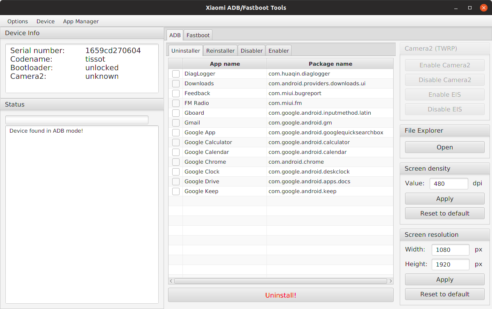

# Xiaomi ADB/Fastboot Tools 😊

## Modules

* **App Manager** - Uninstall/reinstall/disable/enable system apps and services on demand
* **Camera2** - Enable Camera2 and EIS (TWRP required)
* **File Explorer** - Transfer files between a device and a computer using ADB
* **Screen density** - Tweak screen density by overriding the DPI value
* **Screen resolution** - Tweak screen resolution by overriding the width and height values
* **Device properties** - Retrieve tons of statistics and information about your device
* **Flasher** - Flash any partition with an image, boot to any image or flash a Fastboot ROM (unlocked bootloader required)
* **Wiper** - Wipe the cache or perform a factory reset
* **OEM Unlocker & Locker** - Lock or unlock the bootloader (Unlocking is only supported by Android One devices)
* **ROM Downloader** - Get links to the latest MIUI Fastboot ROMs or download them right away
* **Rebooter** - Advanced rebooting options using ADB/Fastboot

## Downloads

Available downloads:

* Executable JAR
* OS-specific ZIP (Executable JAR with ADB and Fastboot included)

If you have ADB and Fastboot installed system-wide, download the JAR, otherwise download the OS-specific ZIP.

### [Latest release](https://github.com/Saki-EU/XiaomiADBFastbootTools/releases/latest)

**Warning: Use the program at your own risk!**

## Instructions

### Connecting a device in ADB mode

1. Enable developer options in Android.

    * MIUI: Go to Settings > About device and tap ‘MIUI version’ seven times to enable developer options.
    * Android One: Go to Settings > System > About device and tap ‘Build number’ seven times to enable developer options.

2. Enable USB debugging in Android.

    * MIUI: Go to Settings > Additional settings > Developer options and enable USB debugging.
        * In order to use the Screen density and Screen resolution modules, enable USB debugging (Security settings) as well.
    * Android One: Go to Settings > System > Developer options and enable USB debugging.

3. Connect your device to the computer and launch the application. The device is going to ask for authorisation, which you'll have to allow.

4. Wait for the application to detect your device. The device info should appear in the top left section.

### Connecting a device in Fastboot mode

1. Put your device into Fastboot mode by holding power and volume down simultaneously until the Fastboot splash screen comes up.

    * If your device is loaded in ADB mode, you can enter Fastboot mode by clicking Menu > Reboot device to Fastboot.

2. Connect your device to the computer and launch the application.

3. Wait for the application to detect your device. The device info should appear in the top left section.

## FAQ & Troubleshooting

**The application doesn't work. Is there anything I should have installed?**

Yes, the Xiaomi ADB/Fastboot Tools was developed in Kotlin for the Java Virtual Machine so it needs the JRE to run, version 1.8.171 or later. You can install the latest Oracle JRE from [here](https://java.com/en/download/).

If the application says that it cannot find ADB/Fastboot even though you have downloaded the OS-specific ZIP, open a terminal inside the extracted folder and enter `java -jar something.jar`.

**The app on Windows doesn't detect my device even though it's connected and USB debugging is enabled. What could be the issue?**

Windows most likely doesn't recognise your device in ADB mode. Install the universal ADB drivers from [here](http://dl.adbdriver.com/upload/adbdriver.zip), reboot your PC and try again.

**Do I need an unlocked bootloader or root access to use the app?**

The Flasher, Wiper and Camera2 modules require an unlocked bootloader but everything else works without rooting or unlocking.

**What apps are safe to uninstall?**

All applications in the list are safe to uninstall. You might lose access to some services but the device will keep working just fine. Some apps, like Gallery, aren't listed because uninstalling them would soft brick your device.

**Do uninstalled system apps affect OTA updates?**

No, you are free to install updates without the fear of bricking your device or losing data.

**Do uninstalled system apps come back with updates?**

No, uninstalled apps should only come back when you reinstall them or factory reset your device.

**Why does the Uninstaller hang on some apps?**

There are many factory apps Global MIUI doesn't let you uninstall but China MIUI does. If you try to uninstall an app like that, the tool will hang. If that happens, close the tools, disconnect your device, uninstall the app manually, then launch the tools again and reconnect your device to proceed.

**How do I regain uninstalled system apps?**

Simply reinstall them using the Reinstaller module when connected in ADB mode.

**The app is called Xiaomi ADB/Fastboot Tools. Does that mean that it only works with Xiaomi devices?**

ADB and Fastboot are universal interfaces on Android but some of the algorithms and methods used in the app are specific to Xiaomi devices, so yes.

**Does this replace MiFlash or MiUnlock?**

No. Fastboot ROM flashing is available so MiFlash can mostly be substituted but implementing EDL flashing or MIUI unlocking would only make the program unnecessarily complex.
